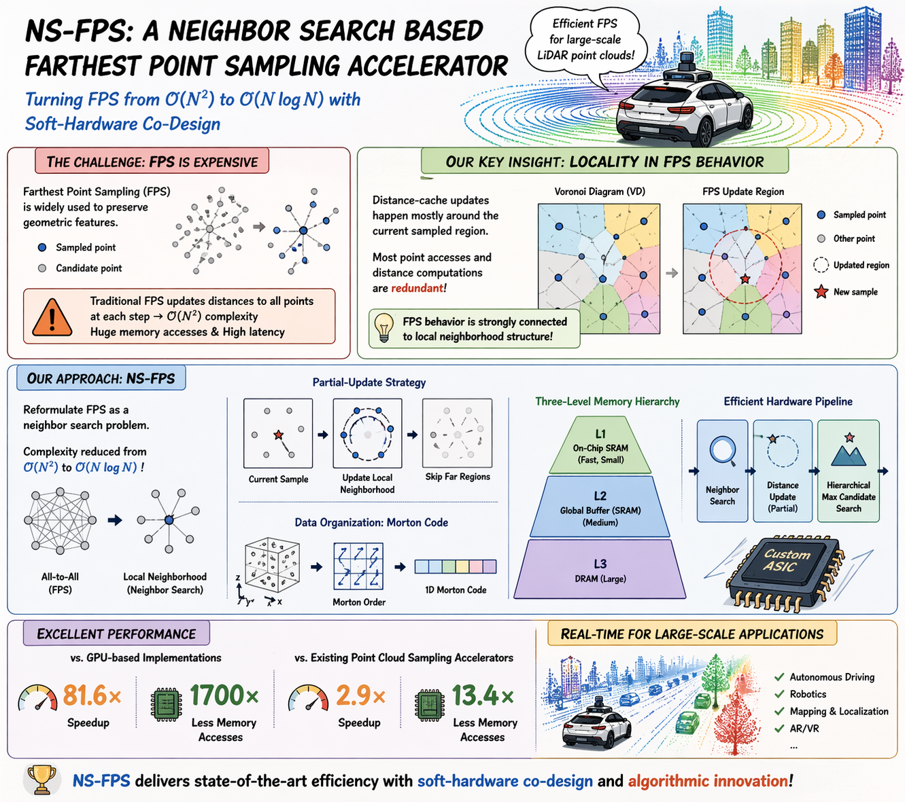

# Yuezu FPS

High-performance Farthest Point Sampling (FPS) implementation based on Morton-coded neighbor search and multi-level caching.



## Features

- **Spatial Adaptivity**: Independent granularity configuration per dimension (e.g., X:32, Y:16, Z:8)
- **Multi-Level Caching**: 16-1 tree structure for global farthest point query
- **Incremental Update**: Only update affected spatial blocks instead of full traversal
- **Python Binding**: Complete pybind11 interface with seamless NumPy integration

## Installation

### Requirements

- Python >= 3.7
- NumPy
- pybind11
- C++17 compiler (GCC >= 7 or Clang >= 5)

### Install from Source

```bash
git clone https://github.com/yourusername/yuezu_fps.git
cd yuezu_fps
pip install -e .
```

### Verify Installation

python -c "import yuezu_fps.yuezu_fps_module as yf; print(yf.DEFAULT_X_BLOCKS)"

### Quick Start

```python
import numpy as np
import yuezu_fps.yuezu_fps_module as yf

# Generate point cloud
points = np.random.randn(10000, 3).astype(np.float32)

# Create SpaceRange (manual range + granularity)
space_range = yf.make_range(
    min_x=-100, max_x=100,
    min_y=-100, max_y=100,
    min_z=-100, max_z=100,
    x_blocks=16, y_blocks=16, z_blocks=16
)

# Execute FPS
indices = yf.fps(points, n_samples=1000, range=space_range)

# Get sampled points
sampled_points = points[indices]
```

## Core Concepts

### SpaceRange

Defines sampling space range and block granularity:

| Parameter        | Type   | Description                                       |
| ---------------- | ------ | ------------------------------------------------- |
| `min_x`, `max_x` | float  | X-axis range                                      |
| `min_y`, `max_y` | float  | Y-axis range                                      |
| `min_z`, `max_z` | float  | Z-axis range                                      |
| `x_blocks`       | uint32 | X-axis block count (power of 2, e.g., 8/16/32/64) |
| `y_blocks`       | uint32 | Y-axis block count (power of 2, e.g., 8/16/32/64) |
| `z_blocks`       | uint32 | Z-axis block count (power of 2, e.g., 8/16/32/64) |

### Morton Encoding

Interleaves 3D block index (ix, iy, iz) into 1D code, preserving spatial locality.

Total blocks = x_blocks × y_blocks × z_blocks
Encoding bits = x_bits + y_bits + z_bits

## Complete Example

See `example.py`:

## Configuration Macros (Compile-time)

| Macro               | Default | Description                              |
| ------------------- | ------- | ---------------------------------------- |
| `MORTON_BLOCK_SIZE` | 16      | Points per leaf block (power of 2)       |
| `CACHE_BLOCK_SIZE`  | 16      | Cache tree branching factor (power of 2) |
| `DEFAULT_X_BLOCKS`  | 16      | Default X granularity                    |
| `DEFAULT_Y_BLOCKS`  | 16      | Default Y granularity                    |
| `DEFAULT_Z_BLOCKS`  | 16      | Default Z granularity                    |
| `BOUNDARY_EPS`      | 1e-6f   | Boundary tolerance                       |
| `INF_DISTANCE`      | 1e30f   | Initial infinity distance                |

```bash
# Custom compilation
g++ -O3 -std=c++17 -DMORTON_BLOCK_SIZE=32 -DCACHE_BLOCK_SIZE=32 ...
```

## Project Structure

```pain
yuezu_fps/                      # Package root
├── example.py                  # Usage examples
├── test.py                     # Verification tests
├── setup.py                    # Build configuration
├── README.md                   # This document
├── yuezu_fps/                     # Python binding
│   └── yuezu_fps_pybind.cpp    # pybind11 interface
└── src/                        # Core implementation
    ├── yuezu_fps.h             # Core header
    └── yuezu_fps.cpp           # Core implementation
```


## License

MIT License

Copyright (c) 2024 Yuezu FPS Contributors